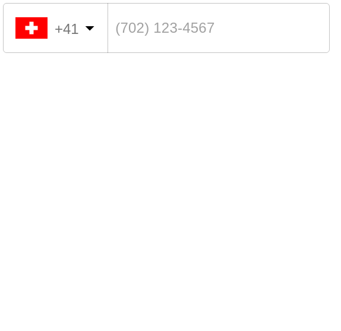

# mui-phone-number

Highly customizable phone input component with auto formatting.



Uses `@material-ui/core/TextField` for rendering the phone input

## Installation

```shell
npm install mui-phone-number
```

```shell
yarn add mui-phone-number
```

## Usage

```jsx
import MuiPhoneNumber from 'mui-phone-number'

<MuiPhoneNumber defaultCountry={'us'} onChange={handleOnChange} />
```

Your handler for the `onChange` event should expect a string as
parameter, where the value is that of the entered phone number. For example:

```jsx
function handleOnChange(value) {
  this.setState({
    phone: value,
  })
}
```

## Options

<table>
  <tr>
    <th> Name </th>
    <th> Type </th>
    <th> Description </th>
    <th> Example </th>
  </tr>
  <tr>
    <td> excludeCountries </td>
    <td> array </td>
    <td> array of country codes to be excluded </td>
    <td> ['cu','cw','kz'] </td>
  </tr>
  <tr>
    <td> onlyCountries </td>
    <td> array </td>
    <td> country codes to be included </td>
    <td> ['cu','cw','kz'] </td>
  </tr>
  <tr>
    <td> preferredCountries </td>
    <td> array </td>
    <td> country codes to be at the top </td>
    <td> ['cu','cw','kz'] </td>
  </tr>
  <tr>
    <td> defaultCountry </td>
    <td> string </td>
    <td> initial country </td>
    <td> 'us' </td>
  </tr>

  <tr>
    <td> inputClass </td>
    <td> string </td>
    <td colspan="2"> class for input </td>
  </tr>
  <tr>
    <td> dropdownClass </td>
    <td> string </td>
    <td colspan="2"> class for dropdown container </td>
  </tr>

  <tr>
    <td> autoFormat </td>
    <td> bool </td>
    <td colspan="2"> on/off auto formatting, true by default </td>
  </tr>
  <tr>
    <td> disableAreaCodes </td>
    <td> bool </td>
    <td colspan="2"> disable local codes for all countries </td>
  </tr>
  <tr>
    <td> disableCountryCode </td>
    <td> bool </td>
    <td colspan="2"> false by default </td>
  </tr>
  <tr>
    <td> disableDropdown </td>
    <td> bool </td>
    <td colspan="2"> false by default </td>
  </tr>
  <tr>
    <td> enableLongNumbers </td>
    <td> bool </td>
    <td colspan="2"> false by default </td>
  </tr>
  <tr>
    <td> countryCodeEditable </td>
    <td> bool </td>
    <td colspan="2"> true by default </td>
  </tr>

  <tr>
    <td colspan="4"><b>Supported TextField props</b></td>
  </tr>

  <tr>
    <td colspan="4">See TextField API for possible values https://material-ui.com/api/text-field/</td>
  </tr>
</table>

### Regions

<table>
  <tr>
    <th> Name </th>
    <th> Type </th>
    <th> Description </th>
  </tr>
  <tr>
    <td> regions </td>
    <td> array/string </td>
    <td> to only show codes from selected regions </td>
  </tr>
</table>

<table>
  <tr>
    <th> Regions </th>
  </tr>
  <tr>
    <td> ['america', 'europe', 'asia', 'oceania', 'africa'] </td>
  </tr>
  <tr>
    <th> Subregions </th>
  </tr>
  <tr>
    <td> ['north-america', 'south-america', 'central-america', 'carribean', 'european-union', 'ex-ussr', 'middle-east', 'north-africa'] </td>
  </tr>
</table>

Regions selected: {'europe'}

```jsx
<MuiPhoneNumber defaultCountry="it" regions={'europe'} />
```

Regions selected: {['north-america', 'carribean']}

```jsx
<MuiPhoneNumber defaultCountry="ca" regions={['north-america', 'carribean']} />
```

### Localization

<table>
  <tr>
    <th> Name </th>
    <th> Type </th>
  </tr>
  <tr>
    <td> localization </td>
    <td> object </td>
  </tr>
</table>

```jsx
<MuiPhoneNumber onlyCountries={['de', 'es']} localization={{ Germany: 'Deutschland', Spain: 'España' }} />
```

### Supported events

<table>
  <tr>
    <td> onChange </td>
    <td> onFocus </td>
    <td> onBlur </td>
    <td> onClick </td>
    <td> onKeyDown </td>
  </tr>
</table>

Country data object is not returned from onKeyDown event.

<table>
  <tr>
    <th> Data </th>
    <th> Type </th>
    <th> Description </th>
  </tr>
  <tr>
    <td> value/event </td>
    <td> string/object </td>
    <td> the event or the phone number </td>
  </tr>
  <tr>
    <td> country data </td>
    <td> object </td>
    <td> the country object { name, dialCode, country code (iso2 format) } </td>
  </tr>
</table>

## Development

To start and open the demo page:

```shell
yarn dev
```

## License

[MIT](https://opensource.org/licenses/MIT)

Based on:

- [material-ui-phone-number-2](https://github.com/justdvl/material-ui-phone-number-2)
- [material-ui-phone-number](https://github.com/alexplumb/material-ui-phone-number)
- [react-phone-input-2](https://github.com/bl00mber/react-phone-input-2)
- [react-phone-input](https://github.com/razagill/react-phone-input)
